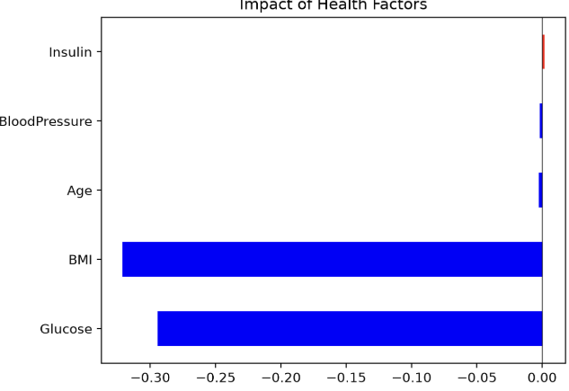
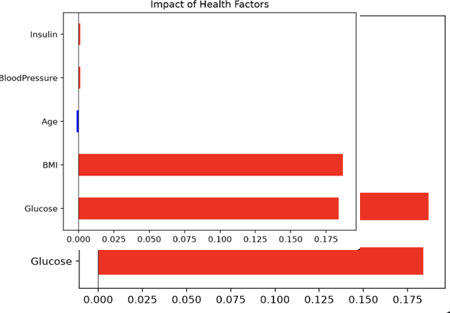

\# Medi-Trust: Explainable AI for Healthcare Risk

Medi-Trust is an end-to-end Machine Learning system that predicts health risks while explaining "Why" the prediction was made using SHAP values.

\## Features

\- \*\*Random Forest Classifier:\*\* For robust tabular data prediction.

\- \*\*Explainable AI (XAI):\*\* Uses SHAP to provide transparency for clinical decisions.

\- \*\*Interactive Dashboard:\*\* Built with Streamlit for real-time analysis.

\## How to Run

1\. Install requirements: `pip install -r requirements.txt`

2\. Run app: `streamlit run app.py`
## 📊 Project Preview

| Healthy Case (Low Risk) | High Risk Case (Detected) |
| :---: | :---: |
|  |  |

> **Note:** The SHAP visualization explains how each health metric contributes to the final prediction. Blue bars indicate protective factors, while red bars indicate risk factors.
